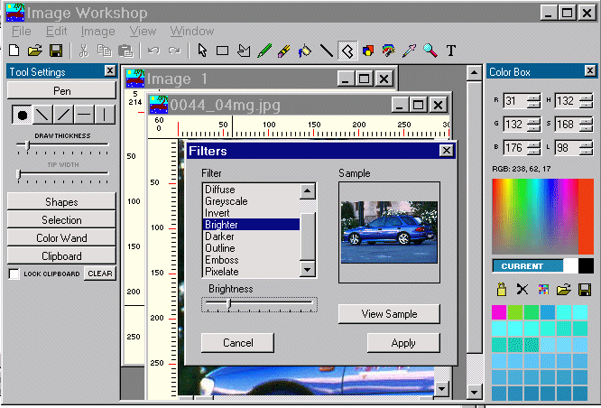



## Bobo Image Workshop

### Description

This is an app I wrote early last year to see how far I could go with VBs' graphic editing capabilities. It's still a work in progress and could do with a rewrite. After Stu Lishman uploaded his latest version of Stu Paint I added Twain support, thanks Stu. The program was thrown together quickly but is none the less complete and working, with only one or two minor bugs. It does most things Paint Shop Pro will do. I have a version with layers that works quite well but is less complete than this version. It demonstrates cut, copy, paste, selection, freehand selection, shapes, multiple clipboards, color handling, effects, filter browser, inserting text, magnifying, rotation, inversion, MDI window control, toolwindows, MRU lists, Temp files, Undo/Redo, buttonising etc.etc. Some of the effects are modified versions of code downloaded from PSC. Unlike most of my other submissions there is very little commenting of code - it's too big now and I've forgotten more of the functions than I remember. For the more advanced coders however it should not be too difficult to follow. It was an experiment however, so there is some duplication of both code and controls, with heaps of room for optimising.
 
### More Info
 

             |
---                |---
**Submitted On**   |2001-03-03 21:16:32
**By**             |[MrBobo](https://github.com/Planet-Source-Code/PSCIndex/blob/master/ByAuthor/mrbobo.md)
**Level**          |Intermediate
**User Rating**    |5.0 (135 globes from 27 users)
**Compatibility**  |VB 6\.0
**Category**       |[Graphics](https://github.com/Planet-Source-Code/PSCIndex/blob/master/ByCategory/graphics__1-46.md)
**World**          |[Visual Basic](https://github.com/Planet-Source-Code/PSCIndex/blob/master/ByWorld/visual-basic.md)
**Archive File**   |[CODE\_UPLOAD15749332001\.zip](https://github.com/Planet-Source-Code/mrbobo-bobo-image-workshop__1-21482/archive/master.zip)

